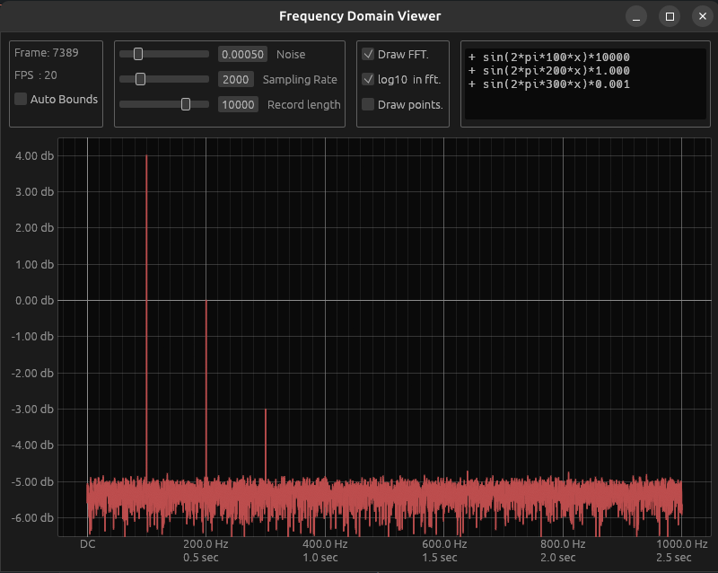

# Rusty Waveform & FFT Visualizer

A real-time waveform generator and FFT spectrum analyzer written in **Rust**.

The application allows users to generate mathematical waveforms from equations, add configurable noise, and visualize both the signal and its frequency spectrum in real time.

---

## Screenshot




---
## Features

- Real-time waveform generation
- Fast Fourier Transform (FFT) visualization
- Mathematical expression parser
- Adjustable noise floor
- Configurable sampling rate
- Configurable record length
- Linear and Log10 FFT display
- Scatter or Line plotting
- CSV import/export support
- Puffin performance profiling

---


## Building

Clone the repository

```bash
git clone https://github.com/<your-name>/rusty-waveform.git
cd rusty-waveform
```

Run

```bash
cargo run --release
```

---

## Controls

### Waveform

Enter any mathematical expression using **t** as the time variable.

Example expressions:

```text
sin(2*pi*100*t)

0.5*sin(2*pi*50*t)

sin(2*pi*10*t)+0.5*sin(2*pi*100*t)

exp(-t)*sin(2*pi*20*t)

abs(sin(2*pi*5*t))
```

---

## FFT

The application computes a Fast Fourier Transform (FFT) of the generated waveform using the excellent **rustfft** crate.

Current features:

- Half-spectrum display
- Optional logarithmic scaling
- Automatic amplitude normalization

---


## Performance

The application includes Puffin instrumentation for profiling.

Launch Puffin Viewer and connect to the application to inspect:

- UI rendering
- FFT processing
- Plot rendering
- Waveform generation

---

Future versions will separate these into individual modules.

---

## Roadmap

- [ ] Multiple waveforms
- [ ] Cached FFT plans
- [ ] Cached expression compilation
- [ ] Windowing functions
- [ ] Spectrogram
- [ ] FFT averaging
- [ ] Peak detection
- [ ] Zoom & pan improvements
- [ ] Export FFT data
- [ ] Custom color themes
- [ ] Performance optimizations

---
